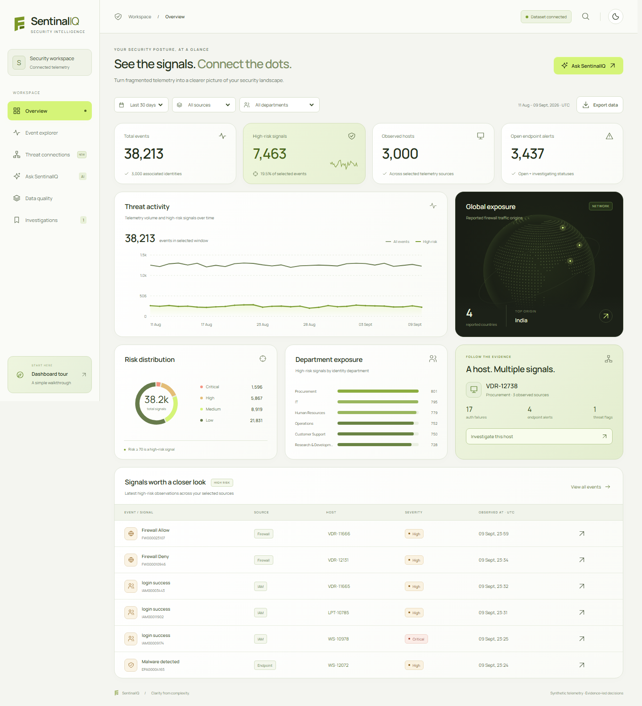

# Sentinel IQ

**See the signals. Connect the dots.** A security intelligence workspace for the TransOrg AgentIQ Datathon, built on the supplied Track 2 zero-trust telemetry dataset.

[](https://github.com/Arjun-Walia/sentinel-iq/actions/workflows/checks.yml)



Four fragmented sources become one inspectable security story: **62,430 source records → 61,000 clean records → 58,000 unified telemetry events and 3,000 identities.** Every headline number comes from DuckDB. The supplied dataset is synthetic and educational; the application does not monitor a live network.

## What you can do

- **Overview:** filter by time window, source, and department; explore activity, severity, country origins, and departmental exposure. Click a department to filter the whole dashboard.
- **Event explorer:** search hosts, identities, alert names, and event IDs; filter severity, paginate, inspect cleaned source records, and export the exact selected scope as CSV.
- **Threat connections:** investigate a host across IAM, endpoint, and firewall evidence. Source nodes filter the timeline. Shared hosts are observed associations, not a claim of causal attack sequences.
- **Ask Sentinel:** ask supported security questions and receive a bar or line chart, a factual summary, SQL, parameters, and downloadable answer data. Works without an API key.
- **Data quality:** inspect source counts, field normalization, invalidated values, duplicate removal, unresolved joins, impossible resolution timestamps, and source SHA-256 fingerprints.
- **Investigations:** persist host status and analyst notes in SQLite. Reopen cases with all-time evidence even after changing dashboard filters.

The interface uses locally bundled typography, custom SVG charts and a decorative globe. No frontend framework, bundler, chart CDN, vector database, or paid service is required.

## Run locally

Python **3.12+** recommended. From the repository directory:

```powershell
python -m venv .venv
.venv\Scripts\python -m pip install -r requirements.txt
.venv\Scripts\python app.py
```

On macOS/Linux:

```bash
python3 -m venv .venv
.venv/bin/python -m pip install -r requirements.txt
.venv/bin/python app.py
```

Open **[localhost:5000](http://localhost:5000)**. The first start automatically runs the pipeline; later starts use the existing database. Waitress serves the app with debugging disabled. `HOST` defaults to `127.0.0.1`; `PORT` defaults to `5000`.

To rebuild after changing source data or pipeline logic, stop the app and run:

```powershell
.venv\Scripts\python pipeline.py
.venv\Scripts\python app.py
```

The source folder must retain the four original filenames. Source files are never modified. Generated clean CSVs, DuckDB, quality report, and SQLite cases stay in the ignored `data/` directory. Rebuilding telemetry preserves saved cases. A new dataset must satisfy the same column schema.

## Small, readable structure

| File | Responsibility |
| --- | --- |
| `pipeline.py` | Parsing, normalization, validation, reconciliation, clean exports, and analytical views |
| `app.py` | Flask API, parameterized DuckDB queries, bounded assistant, and saved cases |
| `templates/index.html` | Six dashboard views and accessible dialogs |
| `static/app.js` | Rendering, SVG visualizations, filtering, search, investigation and assistant interactions |
| `static/style.css` | Dark/lime design system, responsive layouts, and reduced-motion support |
| `vercel.json` | Serverless limits and deployment bundle exclusions |
| `test_app.py` | 29 behavior and reproducibility tests |

## Data rescue and EDA

| Source | Raw rows | Clean rows | Primary key |
| --- | ---: | ---: | --- |
| Firewall CSV | 30,600 | 30,000 | `log_id` |
| IAM JSON | 20,500 | 20,000 | `event_id` |
| Endpoint XLSX | 8,240 | 8,000 | `alert_id` |
| Identity master CSV | 3,090 | 3,000 | normalized `user_id` |

The pipeline removes **1,430 duplicate primary-key records**, preferring the most complete normalized row with stable source-order ties. It keeps unresolved values null rather than inventing replacements. Each source report records changed and invalidated fields before deduplication; a formatting or type change also counts as changed.

Normalization policies:

- `EMP-12345`, `emp_12345`, `EMP 12345`, and `12345` become `EMP12345`. Device and session IDs follow the same prefix policy.
- Hosts are uppercased; underscores become hyphens; the `.corp.local` suffix is removed. Known department aliases use an explicit mapping. Compliance is grouped with Legal, and Supply Chain with Procurement.
- Unix seconds/milliseconds and mixed date strings are parsed. Slash dates are day-first. Hyphenated 12-hour dates are month-first. Naive source times are assumed UTC; timezone-aware values are converted to UTC. This explicit format assumption should be revisited if organizers clarify ambiguous dates.
- Invalid IPs are nulled without guessing missing octets. Ports must be integers from 0 to 65,535. Negative/invalid byte quantities are null; KB/MB/GB use binary multiples of 1,024. Country abbreviations resolve to the four supplied countries.
- Firewall action/protocol aliases and booleans are normalized. IAM login success, login failure, and MFA failure remain distinguishable. Endpoint labels, severity, status, and SHA-256 values are normalized or validated.
- **263** endpoint records have resolution before detection: resolution time is cleared and the issue flagged. Valid resolution durations remain available in the API.
- **6,909** events have missing/unparseable timestamps; they remain in All time and exports, but are excluded from date windows and time-series charts.
- **3,335** events lack a matched identity. They remain in the event model with an explicit flag. The supplied master is authoritative for identity departments and status. User-ID joins take precedence, followed by normalized host matches.

For a complete field-level audit, open **Data quality**, inspect `data/quality.json`, or request `/api/quality`. Event-level flags cover missing timestamps, unmatched identities, impossible resolutions, inferred IAM risk, and endpoint/master host mismatches. Other invalid fields are exposed as nulls in cleaned source records and source-level audit counts.

## Analytical model and data dictionary

`identities`, `firewall`, `iam`, and `endpoint` retain the source column names with normalized values. `events` unifies telemetry without multiplying rows during joins. Two SQL views, `daily_activity` and `host_exposure`, provide reusable aggregations.

| Unified field | Meaning |
| --- | --- |
| `id`, `source` | Original stable source event ID and `firewall` / `iam` / `endpoint` |
| `timestamp` | Observation time, UTC-naive; nullable |
| `hostname`, `user_id`, `username` | Normalized host and associated identity; missing relationships remain unresolved |
| `department`, `identity_status` | Identity-master values when matched; telemetry department or Unknown otherwise |
| `kind` | Normalized IAM event, endpoint alert label, or firewall action label |
| `severity`, `risk` | Reported endpoint severity or derived risk band; explainable prioritization score |
| `status` | Endpoint status, or Observed for IAM/firewall events |
| `source_ip`, `country`, `protocol`, `action` | Validated source network attributes when available; country is the source's reported origin |
| `threat`, `session_id` | Normalized firewall threat flag and source session identifier |
| `quality_flags` | Pipe-separated unresolved conditions relevant to the event |
| `resolution_hours` | Valid endpoint detection-to-resolution duration; null when unavailable or impossible |

`daily_activity`: date, source, department, total events and high-risk count. `host_exposure`: hostname, total events, distinct sources, high-risk count, and peak risk.

### Metric definitions

- **Total events:** count of source telemetry records after deduplication and selected filters; not unique confirmed security incidents.
- **High-risk signals:** events with `risk >= 70`. Endpoint scores are Critical 95, High 75, Medium 45, Low 20, Unknown 0. Firewall scores are flagged 85, otherwise deny 40, otherwise 10. IAM uses valid supplied scores from 0–100; missing/invalid scores fall back to 70 for login/MFA failures or 15 otherwise, with an explicit flag.
- **Derived severity:** Critical ≥90, High ≥70, Medium ≥40, otherwise Low. Endpoint uses its normalized reported severity.
- **Observed hosts / associated identities:** distinct non-null normalized identifiers in the selected events.
- **Open endpoint alerts:** endpoint records whose normalized status is Open or Investigating. False positives and resolved records are excluded.
- **Department exposure:** count of high-risk events by resolved department. The chart shows the top six; it is volume, not a department-size-adjusted risk rate.
- **Host priority:** distinct observed sources, then high-risk event count, then hostname for deterministic ties. The list shows 20 hosts; the drawer shows up to 80 recent events.
- **Global exposure:** firewall events grouped by normalized reported country. Unknown origins are excluded from the country counter. Globe geography is a simplified illustration, not geolocation derived from IP addresses.

Time filters are anchored to the **latest dataset observation, September 9, 2026**, not the system clock. The default 30-day scope is August 11–September 9. All time includes undated events; charts omit undated observations. Risk values are heuristic prioritization signals, not probabilities of compromise.

## Graph-first query assistant

Try:

```text
Show failed logins by department in the last 7 days
Which user has the most failed logins?
Show endpoint alerts by severity
Show daily trend of critical endpoint alerts
Compare firewall allow vs deny actions by protocol
Which hosts have the most threat flags?
Show the MFA failure trend
Show daily telemetry volume
Show top endpoint alert types
Show activity of inactive identities
```

The local engine selects from ten transparent query templates. Optional DeepSeek chooses an intent from the same catalog; SQL execution remains parameterized and read-only. This is a bounded analytical assistant, not unrestricted text-to-SQL or a vector RAG implementation. Unsupported questions receive an explicit response. Comparisons produce bar charts; daily series produce line charts. Results are limited to 60 groups, with scope and parameters included.

Copy `.env.example` to `.env` and set `DEEPSEEK_API_KEY` to enable model-assisted retrieval and intent selection. The configured model is **DeepSeek V4 Flash** (`deepseek-v4-flash`); `DEEPSEEK_MODEL` remains configurable. Only the user's question and the retrieved analytical catalog are sent; raw telemetry stays local. Provider failures are reported visibly with local fallback. Live DeepSeek calls have not been verified without a key; timeout/fallback behavior is tested.

Implementation references: [DuckDB Python DB API](https://duckdb.org/docs/current/clients/python/dbapi), [DeepSeek JSON mode](https://api-docs.deepseek.com/guides/json_mode/). The Manrope font is bundled under the [SIL Open Font License](static/font-license.txt).

## Verification

```powershell
.venv\Scripts\python -m pytest -q
node --check static/app.js
```

Tests rebuild the supplied dataset twice in a temporary directory and compare clean CSV bytes; validate cardinality, chronology, joins, filters, search, pagination, export scopes, query charts, malicious filter strings, provider fallback, and isolated persistent cases. GitHub Actions repeats pipeline and API tests on Ubuntu/Python 3.12.

The UI has also been exercised in Chromium at 1440px desktop and 390px mobile widths, including filtering, empty results, investigation persistence, source evidence, and question-to-chart interactions. Tables scroll within their containers on narrow screens. Keyboard search is Ctrl/Cmd+K, dialogs support Escape, and reduced-motion preferences are respected.

## Vercel deployment

Vercel detects the top-level Flask `app` automatically. Deploy from the repository root with `vercel --prod`; the included configuration keeps the serverless bundle focused on the analytical database and runtime assets. On Vercel, the bundled DuckDB is copied to `/tmp` so the read-only function filesystem can still support the investigation queue for the lifetime of a warm instance.

The page includes Vercel's first-party Web Analytics script. Enable Web Analytics once in the project dashboard before the production deploy; the free Hobby plan includes a monthly allowance for page-view events. The analytics script is privacy-friendly and uses no third-party cookies. Runtime logs remain available from the Vercel deployment page.

## Container deployment

```bash
docker build -t sentinel-iq .
docker run --rm -p 5000:5000 -v sentinel-data:/app/data sentinel-iq
```

The Dockerfile builds the dataset, runs as a non-root user, and starts Waitress. It can be deployed on a Docker-capable hosting service; preserve `/app/data` for investigation persistence. Supply `PORT` when required by the host. The Docker engine was unavailable in the development environment, so the image build itself is not verified. The native Windows app and Linux CI pipeline are verified.

This is a shared educational analyst workspace, with no login or tenant isolation. A public demo should use the supplied synthetic dataset; notes are shared among anyone with access. No public dashboard has been deployed automatically. The repository and local application are ready to run.

## Three-minute demo

1. **The problem (20 sec):** four inconsistent formats, broken identities, invalid network values, and impossible timestamps. Show the Data quality audit and clean record counts.
2. **The rescue (30 sec):** explain explicit normalization, preserved unknowns, source fingerprints, and the one-command reproducible pipeline.
3. **The story (50 sec):** open Overview, narrow to a source or department, inspect a high-risk event, and follow the highlighted host across multiple telemetry sources. Emphasize association versus confirmed compromise.
4. **The action (30 sec):** inspect source records, save an investigation note, and reopen the case from the queue.
5. **The bonus (30 sec):** ask for a critical-alert trend, then expand the generated SQL. Explain deterministic local operation and optional DeepSeek selection.
6. **The close (20 sec):** export the filtered evidence and show passing CI. The differentiator is a usable path from messy source data to an explainable, actionable investigation.
